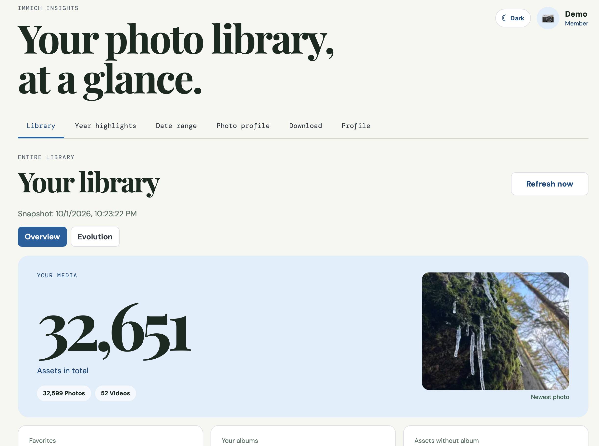
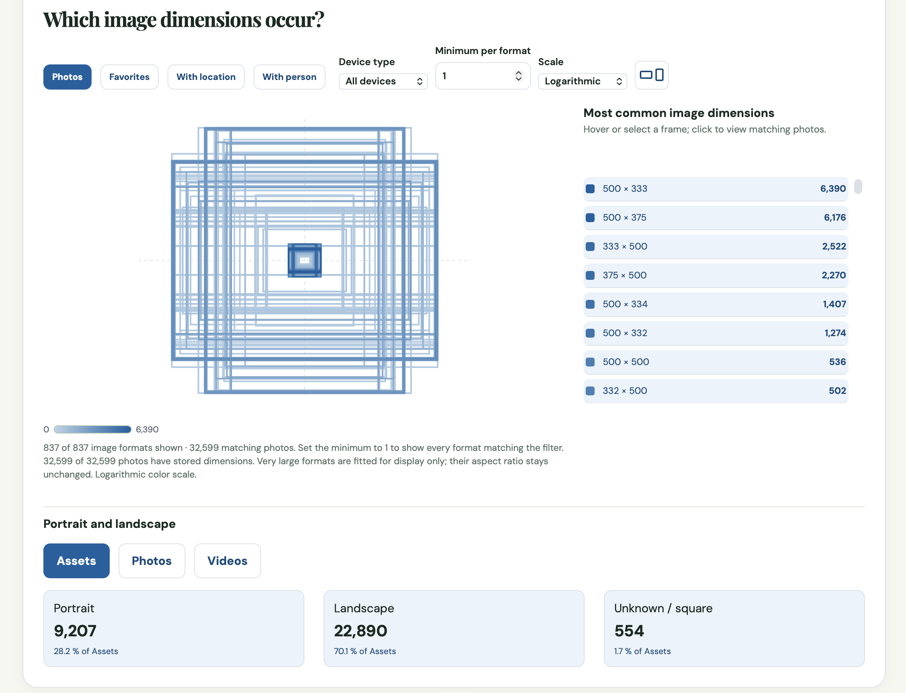
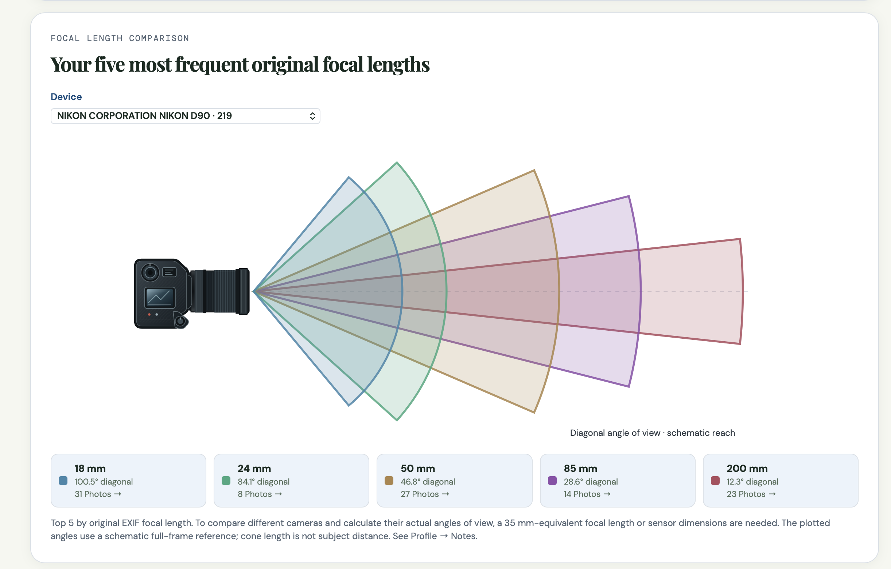
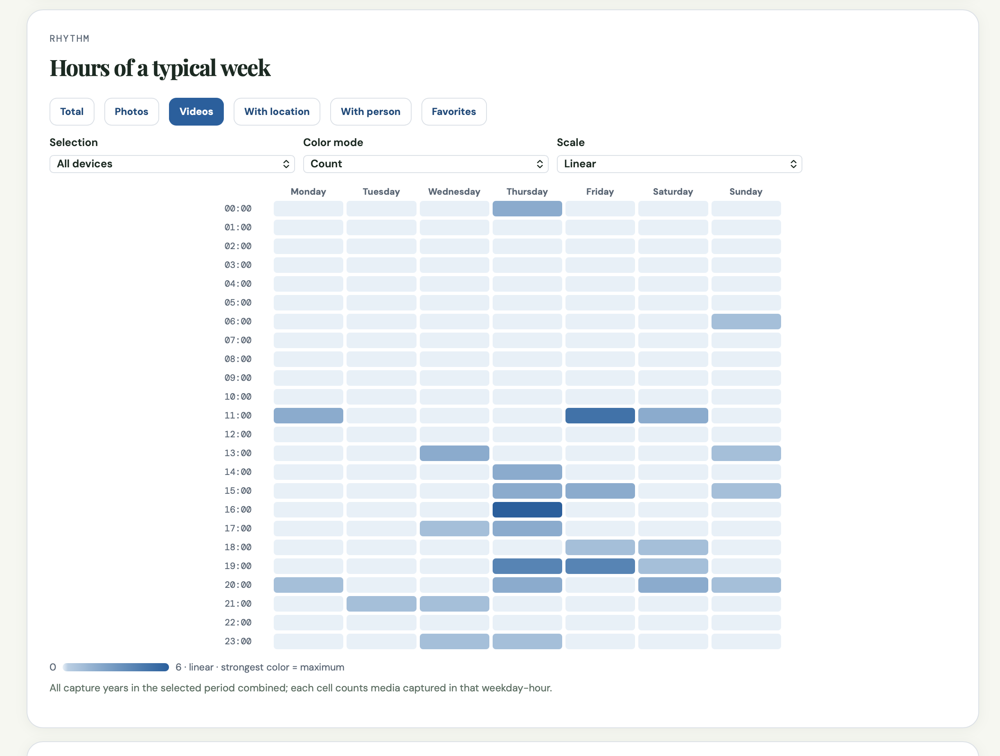
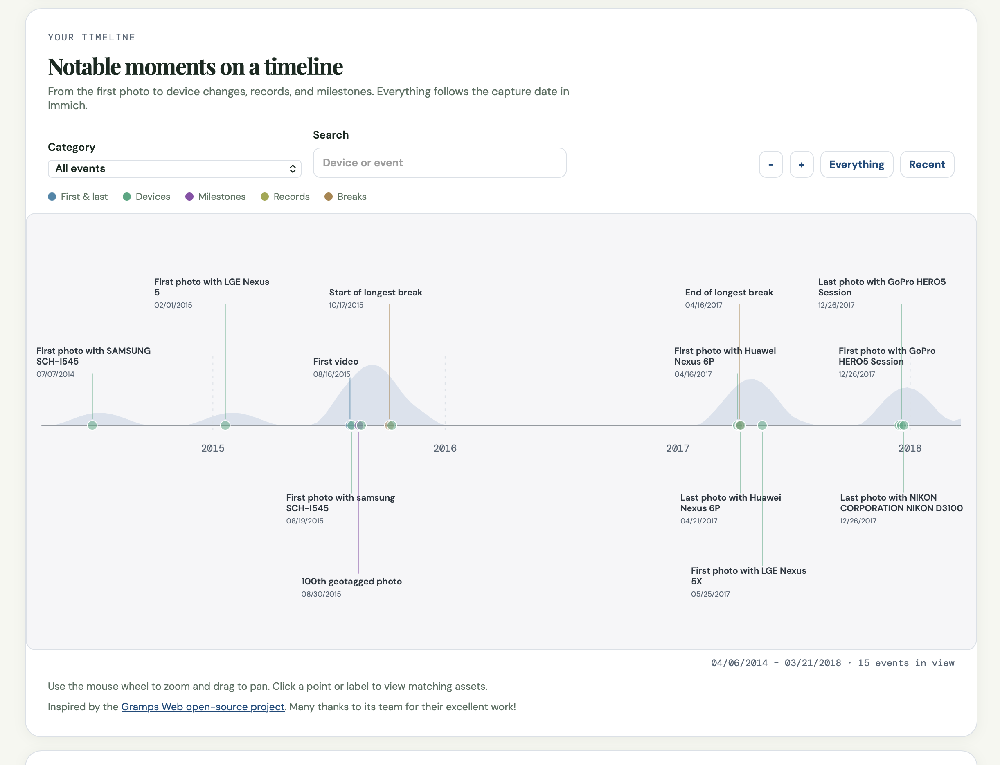
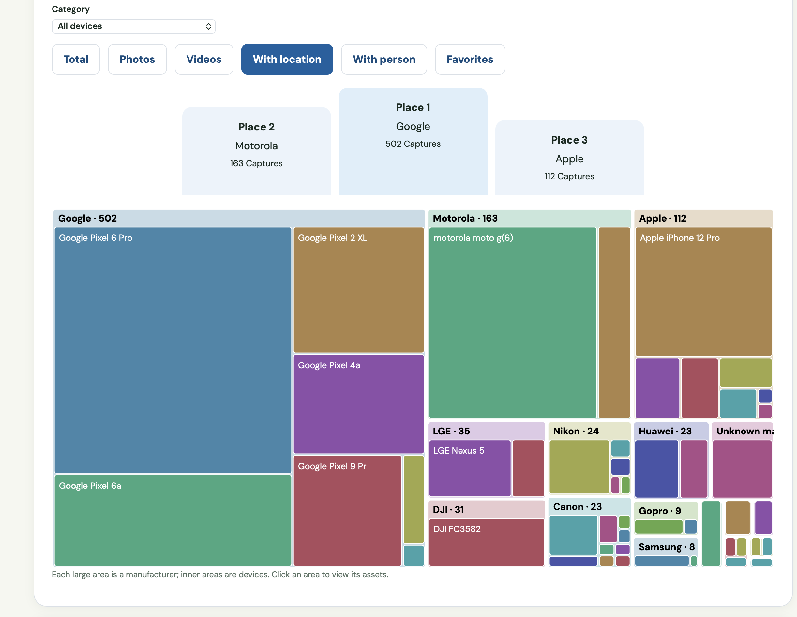
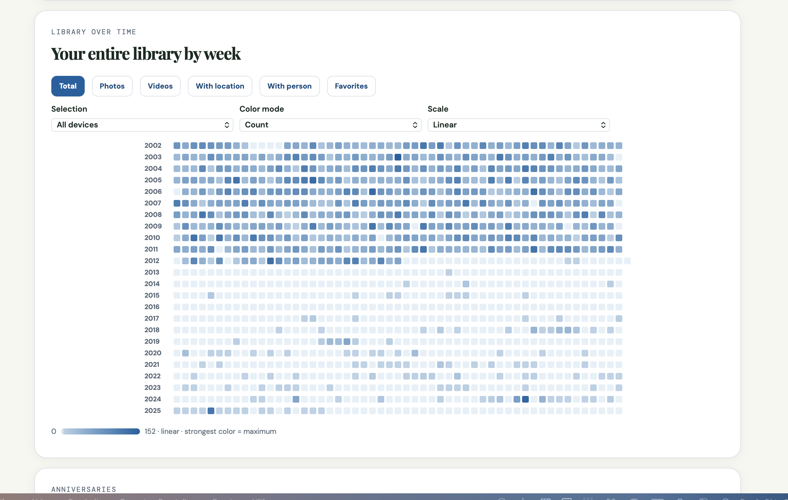
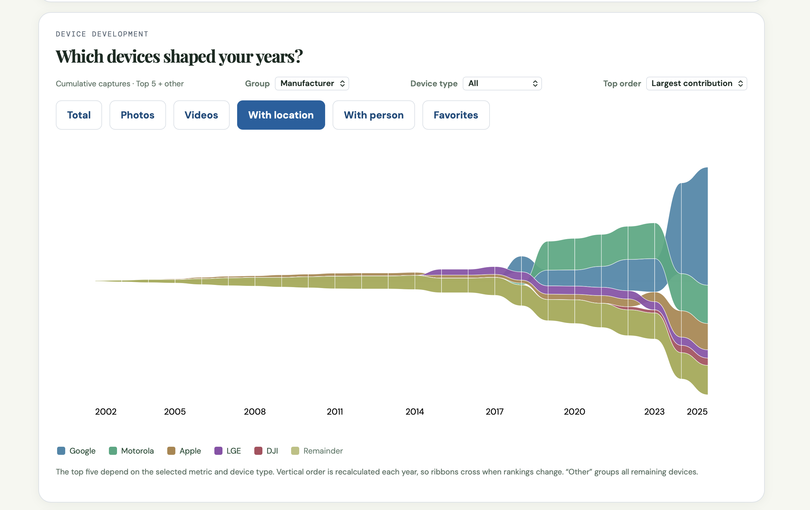

# Immich Insights

Immich Insights is an unofficial, self-hosted statistics dashboard for [Immich](https://immich.app/). It analyzes each member's own library through that member's Immich API key and keeps a local snapshot so switching between charts does not rescan a large library.



The idea is to make full use of the control you have over your own photos and videos — especially when making a personal year-in-review. A future photo-book integration could place selected statistics alongside your images on a page or two.

See the [roadmap](ROADMAP.md) for future ideas. This project is not affiliated with Immich.

## What it does

- Shows library totals, storage, photos and videos, albums, favorites, people, places, devices, and capture history.
- Provides year highlights, a custom date range, a photo profile, interactive charts, heatmaps, a timeline, and links from chart values to the matching cached assets.
- Supports separate accounts and per-account Immich connections. An account cannot browse another account's cached library.
- Uses a manual background sync. After the initial scan, later scans can reuse unchanged assets; the last complete snapshot stays available while a scan runs.
- Exports an account's cached library as SQLite and summary statistics as CSV, PDF, or JPG. The SQLite export is a readable data snapshot, **not** an application backup. Report layouts are basic; richer, more polished downloads are on the roadmap.
- Offers English, German, and Spanish UI, light/dark themes, and selectable accent and chart colors.

The application does not copy original photos or videos into its database. Thumbnails are requested from Immich when needed. The cache and exports **can contain sensitive EXIF metadata, GPS coordinates, filenames, face information, and album names**; handle them accordingly.

## Screenshots

These are some example screenshots of Immich Insights. The library used for the screenshots is the [Demo instance](https://demo.immich.app/photos) by Immich. The latest picture in the first screenshot at top was replaced with another picture due to unsure licensing issues.









## Requirements

- A working Immich server reachable from the **backend container**.
- Docker Engine with Docker Compose, or a NAS Docker UI that can build local Dockerfiles and import `docker-compose.yaml`.
- An existing Docker network shared with Immich for the bundled Compose configuration. Its name is configurable; see [Networking](#networking).
- A personal Immich API key for each member. Do not put these keys in `.env`.

The frontend is published on port **4983**. PostgreSQL and the backend are not exposed to the host by the Compose file.

## Install with Docker Compose

1. Download or clone this repository into a persistent directory on your server or NAS.
2. Copy `.env.example` to `.env`. **Replace the illustrative `POSTGRES_PASSWORD`** with a unique, long password and check `IMMICH_DOCKER_NETWORK` against the actual Docker network name of your Immich installation. Do not deploy with the example password.
3. From that directory, run:

   ```sh
   docker compose up -d --build
   ```

4. Open `http://<NAS-or-server-IP>:4983`. The first account created becomes the administrator.
5. In **Profile**, enter your Immich base URL and personal API key, save the connection, then use **Test connection**. Start the first library sync with **Refresh now**.

Use the Immich **base URL without `/api`**, for example `http://immich-server:2283` when both services share a Docker network, or `http://192.0.2.10:2283` when the container can reach Immich over the LAN. The browser being able to open Immich does not prove that the backend container can reach it.

An administrator can create invitation links in **Profile**. Invitees set their own password and Immich connection. An invitation is displayed once and expires after seven days; an unused invitation can be regenerated.

### Installing through a NAS Docker UI

Copy `docker-compose.yaml`, `.env`, `backend/`, and `frontend/` into the same project directory, then import the Compose file and build the project. Do **not** copy `node_modules/`, `dist/`, `.pnpm-store/`, or local development outputs. Keep `data/` if upgrading an existing installation.

Some NAS interfaces resolve relative bind mounts from a different directory. After the first start, verify that `./data/postgres` and `./data/secrets` are persistent directories under your intended project location. Do not delete or recreate either directory during an upgrade.

## Immich API permissions

The application shows its current permission requirements in **Profile**. They are generated from the API-call registry in `backend/app/immich.py`.

| Permission | Purpose |
| --- | --- |
| `asset.read` | Read your assets and their metadata; required for statistics. |
| `user.read` | Identify the key's owner and exclude shared/partner assets. |
| `album.read` | Count your albums and album membership; optional, but album figures will be unavailable without it. |
| `asset.view` | Display thumbnails; optional. |
| `userProfileImage.read` | Use your Immich profile image; optional. |

Use one personal API key per account and grant only the permissions you need. The administrator account has no UI access to other members' API keys or library views. Anyone with access to the server, database, and encryption key can access the stored data; account isolation is not protection against the server operator.

## Networking

The bundled Compose file attaches `backend` to two networks: its private default network (for PostgreSQL and the frontend) and the existing Immich network named by `IMMICH_DOCKER_NETWORK`. Set that variable in `.env`; the example value `immich-app_default` is **not** universal.

Sharing a Docker network is only needed when the Immich URL uses a container/service hostname. If you use a LAN or HTTPS URL instead, the backend simply needs a route to it. In that case you may remove the `immich` network from `backend.networks` and remove the top-level external network declaration from the Compose file. Never point the app at `localhost:2283` unless Immich runs inside the backend container itself.

If a connection test fails, check the base URL, API permissions, container DNS/routing, and any reverse-proxy or TLS configuration. The UI does not require a browser-to-Immich connection for its statistics.

## Data, security, and backups

| Path | Purpose |
| --- | --- |
| `./data/postgres` | Accounts, cached assets, statistics, album membership, and device corrections. |
| `./data/secrets/fernet.key` | Automatically created encryption key for stored Immich API keys. |

Back up **both directories together**. Stop the stack before making a filesystem-level copy of PostgreSQL data, or use a PostgreSQL-aware backup method; copying its files while it is running is not a reliable backup. Without the original encryption key, existing stored API keys cannot be decrypted. A downloaded SQLite export excludes credentials and cannot restore the application database. PostgreSQL is not published on a host port.

Prefer keeping the service on a trusted home network rather than exposing it directly to the internet: its cache contains private library and location data. If remote access is necessary, use HTTPS, strong access controls, and a trusted reverse proxy. When users access Immich Insights exclusively through HTTPS, set `APP_COOKIE_SECURE=true` in `.env`. On plain HTTP, secure cookies cannot be sent. Passwords are hashed; Immich API keys are encrypted at rest using the persisted Fernet key. The app sets `Cache-Control: no-store` on API responses.

The first sync of a large library may take a long time. Subsequent manual syncs compare asset IDs and update markers and fetch details only when needed. An occasional full scan reconciles metadata changes that Immich does not expose through a reliable change feed. A sync does not replace the last complete snapshot until it succeeds. There is currently no automatic scheduled sync.

When upgrading from an older deployment that used Docker named volumes rather than `./data`, the Compose file will **not** migrate those volumes automatically. Back up and migrate the PostgreSQL data and encryption key together before switching storage locations. Keep the old volumes until the new installation has been verified.

## How statistics are counted

- Only the API-key owner's timeline and archive assets count. Matching IDs are deduplicated; partner libraries, locked assets, and trashed assets are excluded.
- Year and date-range filters use Immich's local capture date, not upload time. Both date-range endpoints are included. Undated assets only appear in full-library totals.
- File sizes are original-file sizes reported by Immich, not thumbnail sizes. Missing size metadata is shown rather than silently treated as zero.
- Live-Photo companion videos are excluded from video-duration totals, but still count where Immich represents them as media and storage.
- MB values are decimal (1 MB = 1,000,000 bytes). Photo-print and sand-grain comparisons are illustrative assumptions, not measurements.

Future ideas are in [ROADMAP.md](ROADMAP.md).

## Development

The backend is FastAPI, SQLAlchemy, and PostgreSQL in production. The frontend is React, TypeScript, and Vite; nginx serves the production build and proxies `/api/` to the backend. Most charts read the per-account snapshot in PostgreSQL instead of calling Immich on every tab change. For local development, use Python 3.13 and Node.js 22, matching the Dockerfiles.

```sh
# Backend (from backend/)
python -m venv .venv
./.venv/bin/pip install -r requirements.txt
./.venv/bin/uvicorn app.main:app --reload

# Frontend (from frontend/, in a second terminal)
npm install
npm run dev
```

For a local frontend talking directly to the backend, set `VITE_API_URL=http://localhost:8000` before running Vite. The backend allows `http://localhost:5173` by default through `APP_CORS_ORIGINS`. The frontend uses an HttpOnly session cookie and CSRF protection for writes.

Run checks before submitting a change:

```sh
# From backend/
python -m unittest discover -s tests

# From frontend/
npm run check:i18n
npm run build
```

`DATABASE_URL` may be set explicitly for custom or local database setups; otherwise a standalone backend uses `sqlite:///./insights.db`. Docker Compose supplies separate PostgreSQL settings so passwords do not require URL encoding. English is the frontend source language. German and Spanish translations live in `frontend/src/de.ts` and `frontend/src/es.ts`; the locale registry and number-format settings live in `frontend/src/i18n.tsx`.

See [CONTRIBUTING.md](CONTRIBUTING.md) for contribution and privacy guidelines.

## Project status and license

Immich Insights is licensed under the [MIT License](LICENSE). See the [roadmap](ROADMAP.md) for planned improvements. Immich's API may change, and the cache schema does not yet use a general migration framework; back up data before upgrading.
